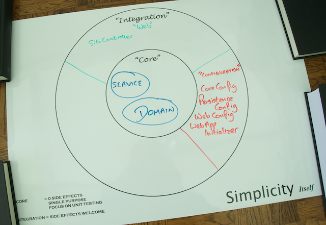
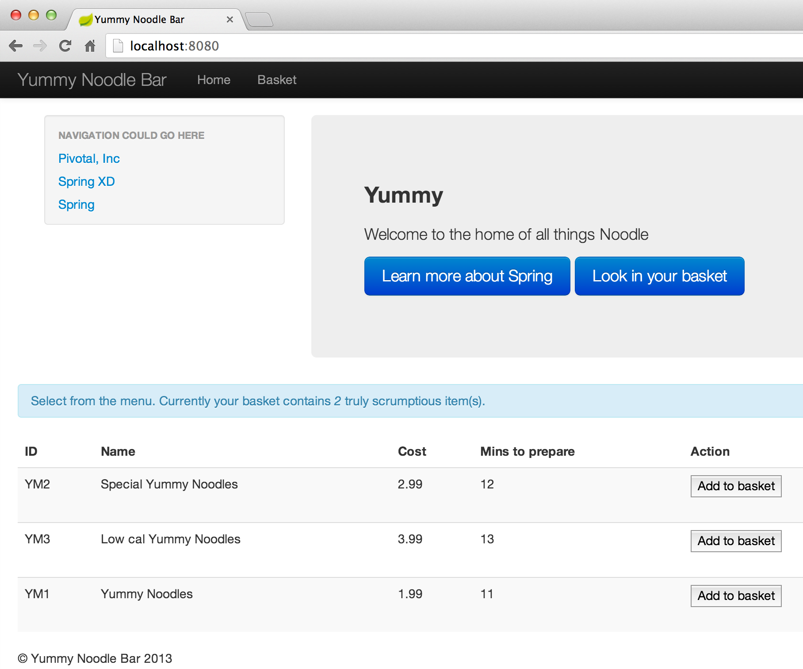
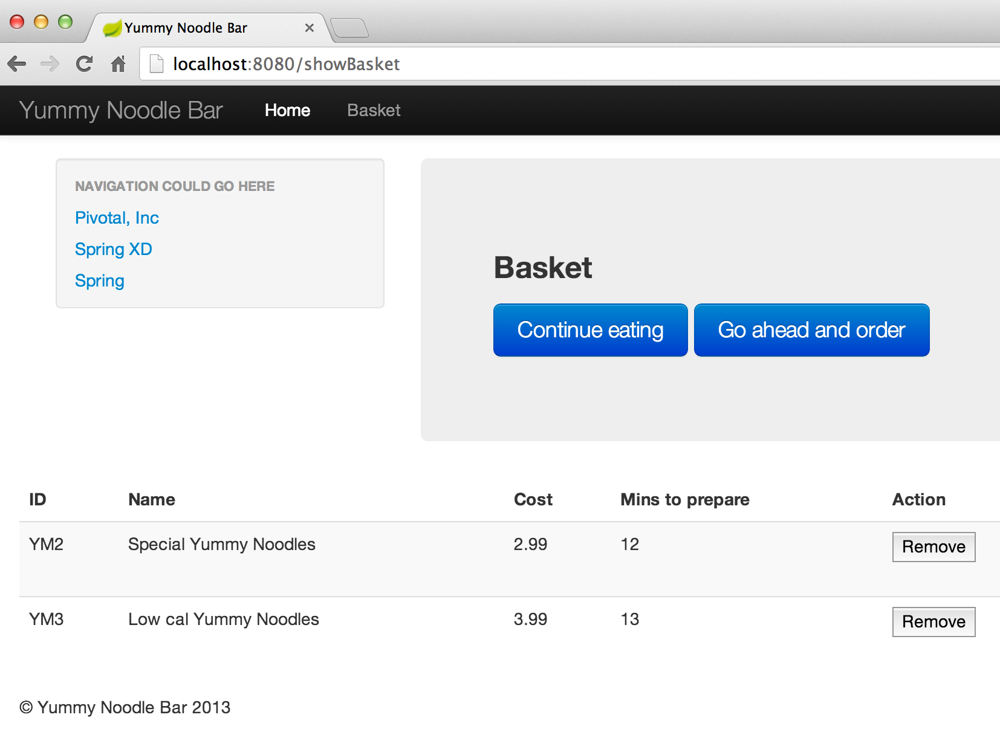

Now that you have [configured and started your application](../2/), which appears in the new Configuration Domain on your life preserver, its time to make the application usable by adding a basket for users to add menu items, and also a view layer to show HTML.



## Step 4: Creating rich HTML views using Thymeleaf

Your application is now ready to:

* Create a basket for the user to keep the items they want in
* Add views to generate HTML.
* Add view fragments to keep common HTML in.

You will be working within the Web domain, first created in step 2.

## Creating a basket

In the Yummy Noodle Bar website, you are going to add the ability for users to add the food items from the menu that they want to a 'basket'.  This will be a list of items, that the user can then choose to convert into an Order.  The order process is something you'll do on the next step; for now you need to create a basket.

Up to now, you have created Spring Components (like `@Controller`) that are shared between all users the system.  The default scope [link] of Spring Components is *Singleton*, so a single instance of the class is shared, everywhere it is used.    A basket can't be like this, instead we need an instance of the Basket *per user*.

While there are several different ways to achieve this, you will use the `Scope` feature of the Spring Application Context to create a *Session* scoped bean and inject it into your Controllers as normal.

### Start with a test

As with the other changes you have made, you must start with a test describing the change in behaviour you wish to make.

Update `SiteControllerIntegrationTest` to read

`src/test/java/com/yummynoodlebar/web/controller/SiteIntegrationTest.java`
```java
package com.yummynoodlebar.web.controller;

import static com.yummynoodlebar.web.controller.fixture.WebDataFixture.allMenuItems;
import static org.hamcrest.Matchers.hasItems;
import static org.hamcrest.Matchers.hasProperty;
import static org.hamcrest.Matchers.hasSize;
import static org.hamcrest.Matchers.is;
import static org.mockito.Matchers.any;
import static org.mockito.Mockito.when;
import static org.springframework.test.web.servlet.request.MockMvcRequestBuilders.get;
import static org.springframework.test.web.servlet.result.MockMvcResultHandlers.print;
import static org.springframework.test.web.servlet.result.MockMvcResultMatchers.forwardedUrl;
import static org.springframework.test.web.servlet.result.MockMvcResultMatchers.model;
import static org.springframework.test.web.servlet.result.MockMvcResultMatchers.status;
import static org.springframework.test.web.servlet.result.MockMvcResultMatchers.view;
import static org.springframework.test.web.servlet.setup.MockMvcBuilders.standaloneSetup;

import org.junit.Before;
import org.junit.Test;
import org.mockito.InjectMocks;
import org.mockito.Mock;
import org.mockito.MockitoAnnotations;
import org.springframework.test.web.servlet.MockMvc;
import org.springframework.web.servlet.view.InternalResourceViewResolver;

import com.yummynoodlebar.core.services.MenuService;
import com.yummynoodlebar.events.menu.RequestAllMenuItemsEvent;
import com.yummynoodlebar.web.domain.Basket;

public class SiteIntegrationTest {

	private static final String STANDARD = "Yummy Noodles";
	private static final String CHEF_SPECIAL = "Special Yummy Noodles";
	private static final String LOW_CAL = "Low cal Yummy Noodles";
	private static final String FORWARDED_URL = "/WEB-INF/views/home.html";
	private static final String VIEW = "/home";


	MockMvc mockMvc;

	@InjectMocks
	SiteController controller;

	@Mock
	MenuService menuService;

	@Mock
	Basket basket;

	@Before
	public void setup() {
		MockitoAnnotations.initMocks(this);

		mockMvc = standaloneSetup(controller)
				.setViewResolvers(viewResolver())
				.build();

		when(menuService.requestAllMenuItems(any(RequestAllMenuItemsEvent.class))).thenReturn(allMenuItems());

	}

	private InternalResourceViewResolver viewResolver() {
		InternalResourceViewResolver viewResolver = new InternalResourceViewResolver();
		viewResolver.setPrefix("/WEB-INF/views");
		viewResolver.setSuffix(".html");
		return viewResolver;
	}

	@SuppressWarnings("unchecked")
	@Test
	public void rootUrlPopulatesViewModel() throws Exception {
		mockMvc.perform(get("/"))
		.andDo(print())
		.andExpect(model().size(2))
		.andExpect(model().attribute("menuItems", hasSize(3)))
		.andExpect(model().attribute("menuItems", hasItems(hasProperty("name", is(STANDARD)),
															hasProperty("name", is(CHEF_SPECIAL)),
															hasProperty("name", is(LOW_CAL))) ))

		.andExpect(model().attributeExists("basket"));
	}

	@Test
	public void rootUrlforwardsCorrectly() throws Exception {
		mockMvc.perform(get("/"))
		.andDo(print())
		.andExpect(status().isOk())
		.andExpect(view().name(VIEW))
		.andExpect(forwardedUrl(FORWARDED_URL));

	}

}
```

This test again uses MockMVC and ensures that the SiteController creates a Model as expected, and also that it *forwards* to the correct url.  A forward is a Servlet concept that allows a piece of code to delegate processing to another at a given URL.  In this case, the test ensures that the SiteController sets the forward URL to the name of a Thymeleaf template to render for the user.

### Create the basket

Now that you have a test, you can start implementation.

Create a new `Basket` in the web domain to represent this new concept.

`src/main/java/com/yummynoodlebar/web/domain/Basket.java`
```java
package com.yummynoodlebar.web.domain;

import org.springframework.context.annotation.Scope;
import org.springframework.context.annotation.ScopedProxyMode;
import org.springframework.stereotype.Component;

import java.util.ArrayList;
import java.util.HashMap;
import java.util.List;
import java.util.Map;

@Component
@Scope(value="session", proxyMode=ScopedProxyMode.TARGET_CLASS)
public class Basket  {

	private Map<String, MenuItem> items = new HashMap<String, MenuItem>();


	public Basket() {

	}

	public Basket(Map<String, MenuItem> items) {
		this.items = items;
	}


	public MenuItem add(MenuItem item) {
		items.put(item.getId(), item);
		return item;
	}


	public void delete(String key) {
		items.remove(key);
	}


	public MenuItem findById(String key) {
		for (MenuItem item : items.values()) {
			if (item.getId().equals(key)) {
				return item;
			}
		}
		return null;
	}


	public List<MenuItem> findAll() {
		return new ArrayList<MenuItem>(items.values());
	}

	public List<MenuItem> getItems() {
		return findAll();
	}

	public int getSize() {
		return items.size();
	}
}
```

The section

`src/main/java/com/yummynoodlebar/web/domain/Basket.java`
```java
@Scope(value="session", proxyMode=ScopedProxyMode.TARGET_CLASS)
```

Specifies that a new instance of the bean will be created for every user session (`HttpSession`), and that this will be managed by an automatically generated proxy.

The result of this is that you may inject the `Basket` as a dependency using `@Autowired` and can use normally. Calls will be routed to the correct instance based on the current session by the automatically generated proxy.

Next, you need to update the SiteController to take advantage of the new `Basket`
Update `SiteController` to read

`src/main/java/com/yummynoodlebar/web/controller/SiteController.java`
```java
package com.yummynoodlebar.web.controller;

import com.yummynoodlebar.core.services.MenuService;
import com.yummynoodlebar.events.menu.AllMenuItemsEvent;
import com.yummynoodlebar.events.menu.MenuItemDetails;
import com.yummynoodlebar.events.menu.RequestAllMenuItemsEvent;
import com.yummynoodlebar.web.domain.Basket;
import com.yummynoodlebar.web.domain.MenuItem;
import org.slf4j.Logger;
import org.slf4j.LoggerFactory;
import org.springframework.beans.factory.annotation.Autowired;
import org.springframework.stereotype.Controller;
import org.springframework.ui.Model;
import org.springframework.web.bind.annotation.ModelAttribute;
import org.springframework.web.bind.annotation.RequestMapping;
import org.springframework.web.bind.annotation.RequestMethod;

import java.util.ArrayList;
import java.util.List;

@Controller
@RequestMapping("/")
public class SiteController {

	private static final Logger LOG = LoggerFactory.getLogger(SiteController.class);

	@Autowired
	private MenuService menuService;

	@Autowired
	private Basket basket;

	@RequestMapping(method = RequestMethod.GET)
	public String getCurrentMenu(Model model) {
		LOG.debug("Yummy MenuItemDetails to home view");
		model.addAttribute("menuItems",getMenuItems(menuService.requestAllMenuItems(new RequestAllMenuItemsEvent())));
		return "/home";
	}

	private List<MenuItem> getMenuItems(AllMenuItemsEvent requestAllMenuItems) {
		List<MenuItem> menuDetails = new ArrayList<MenuItem>();

		for (MenuItemDetails menuItemDetails : requestAllMenuItems.getMenuItemDetails()) {
			menuDetails.add(MenuItem.fromMenuDetails(menuItemDetails));
		}

		return menuDetails;
	}

	@ModelAttribute("basket")
	private Basket getBasket() {
		return basket;
	}
}
```

There are a few things going on here.
Firstly, the injection of the Basket dependency.  As above, only a single SiteController exists in the system, however multiple `Basket` instances exist and can all be accessed via this auto injected proxy.

`src/main/java/com/yummynoodlebar/web/controller/SiteController.java`
```java
	@Autowired
	private Basket basket;
```

The implementation of the request has been altered.  Instead of showing text in the user's browser, a `Model` instance is obtained from Spring MVC and populated with all the current MenuItems.    The method then returns a string "/home".  This is a reference to a *view*, which you will create next.

`src/main/java/com/yummynoodlebar/web/controller/SiteController.java`
```java
	@RequestMapping(method = RequestMethod.GET)
	public String getCurrentMenu(Model model) {
		LOG.debug("Yummy MenuItemDetails to home view");
		model.addAttribute("menuItems",getMenuItems(menuService.requestAllMenuItems(new RequestAllMenuItemsEvent())));
		return "/home";
	}
```

Lastly, you need to put the Basket into the model for the view to be able to read from.
This method takes the auto injected Basket and annotates it so that it is automatically merged into the `Model`.

`src/main/java/com/yummynoodlebar/web/controller/SiteController.java`
```java
	@ModelAttribute("basket")
	private Basket getBasket() {
		return basket;
	}
```

Your `SiteController` now obtains the current Basket and pushes it into the model. Now you need to display that, with a *View*.

## Introducing views

A View is a component that generates HTML that can be sent to the users browser for them to interact with.

You need to create a new View for the SiteController to render.

You will be using the Thymeleaf templating engine. This is a rich and powerful templating engine that provides all of its functionality as attributes on standard HTML.

Before you can use it, you need to add it to your `build.gradle`

`build.gradle`
```gradle
  compile 'org.thymeleaf:thymeleaf-spring3:2.0.18'
```

Now that Thymeleaf is available, create a new file `home.html`

`src/main/webapp/WEB-INF/views/home.html`
```html
<!DOCTYPE html>
<html>
<head>
    <meta http-equiv="Content-Type" content="text/html; charset=UTF-8"/>
    <meta name="viewport" content="width=device-width, initial-scale=1.0"/>
    <meta name="description" content=""/>
    <meta name="author" content="Simplicity Itself"/>

    <title>Yummy Noodle Bar</title>

    <link href="/resources/css/bootstrap.min.css" rel="stylesheet">
    </link>
    <style type="text/css">
        body {
            padding-top: 60px;
            padding-bottom: 40px;
        }

        .sidebar-nav {
            padding: 9px 0;
        }
    </style>
    <!-- See http://twitter.github.com/bootstrap/scaffolding.html#responsive -->
    <link href="/resources/css/bootstrap-responsive.min.css" rel="stylesheet">
    </link>

    <!-- HTML5 shim, for IE6-8 support of HTML5 elements -->
    <!--[if lt IE 9]>
    <script src="http://html5shim.googlecode.com/svn/trunk/html5.js"></script>
    <![endif]-->
</head>
<body>
<div th:include="layout :: head"></div>

<div class="container-fluid">
    <div th:include="layout :: left"></div>
    <div class="hero-unit span9">
        <h3>Yummy</h3>

        <p>
            Welcome to the home of all things Noodle
        </p>

        <p>
            <a class="btn btn-primary btn-large" href="http://www.simplicityitself.com/">Learn more about us</a>
            <a th:if="${basket.size &gt; 0}"
               class="btn btn-primary btn-large"
               th:href="@{/showBasket}">Look in your basket</a>
        </p>

    </div>

    <div class="row-fluid">
        <div class="span9">

            <div id="message" class="alert alert-info">
                Select from the menu. Currently your basket contains <em th:text="${basket.size}">SOME</em> truly
                scrumptious item(s).
            </div>

            <table class="table table-striped">
                <thead>
                <tr>
                    <th>ID</th>
                    <th>Name</th>
                    <th>Cost</th>
                    <th>Mins to prepare</th>
                    <th>Action</th>
                </tr>
                </thead>
                <tbody>

                <tr th:each="item,status : ${menuItems}">
                    <td th:text="${item.id}"></td>
                    <td th:text="${item.name}"></td>
                    <td th:text="${item.cost}"></td>
                    <td th:text="${item.minutesToPrepare}"></td>
                    <td>
                        <form action="/addToBasket" method="POST">
                            <input id="id" name="id" type="hidden" th:value="${item.id}"/>
                            <input id="name" name="name" type="hidden" th:value="${item.name}"/>
                            <input id="cost" name="cost" type="hidden" th:value="${item.cost}"/>
                            <input id="minutesToPrepare" name="minutesToPrepare" type="hidden"
                                   th:value="${item.minutesToPrepare}"/>
                            <input type="submit" value="Add to basket"/>
                        </form>
                    </td>

                </tr>
                <!-- This example data will be removed by thmyeleafe during processing and replaced with the rows generated above -->
                <tr th:remove="all">
                    <td>Yummy1</td>
                    <td>Noodles, with Cheese</td>
                    <td>$13.99</td>
                    <td>15</td>
                </tr>
                </tbody>
            </table>
            <div th:include="layout :: foot"></div>


        </div>
    </div>
</div>
</body>
</html>
```

This will end up looking similar to



This Thymeleaf template reads the model provided by the Controller, namely the `basket` and `menuItems` properties.

Create a view for viewing the current basket too. This will look like :

`src/main/webapp/WEB-INF/views/showBasket.html`
```html
<!DOCTYPE html>
<html>
<head>
    <meta http-equiv="Content-Type" content="text/html; charset=UTF-8"/>
    <meta name="viewport" content="width=device-width, initial-scale=1.0"/>
    <meta name="description" content=""/>
    <meta name="author" content="Simplicity Itself"/>

    <title>Yummy Noodle Bar</title>

    <link href="/resources/css/bootstrap.min.css" rel="stylesheet">
    </link>
    <style type="text/css">
        body {
            padding-top: 60px;
            padding-bottom: 40px;
        }

        .sidebar-nav {
            padding: 9px 0;
        }
    </style>
    <!-- See http://twitter.github.com/bootstrap/scaffolding.html#responsive -->
    <link href="/resources/css/bootstrap-responsive.min.css" rel="stylesheet">
    </link>

    <!-- HTML5 shim, for IE6-8 support of HTML5 elements -->
    <!--[if lt IE 9]>
    <script src="http://html5shim.googlecode.com/svn/trunk/html5.js"></script>
    <![endif]-->
</head>
<body>

<div th:include="layout :: head"></div>

<div class="container-fluid">
    <div th:include="layout :: left"></div>

	<div class="hero-unit span9">
		<h3>Basket</h3>
		<p>
			<a class="btn btn-primary btn-large" href="/">Continue eating</a>
            <a th:if="${basket.size > 0}"
               class="btn btn-primary btn-large" href="/checkout">Go ahead and order</a>
		</p>
	</div>

	<div class="row-fluid">
		<div class="span8">
			<table class="table table-striped">
				<thead>
					<tr>
						<th>ID</th>
						<th>Name</th>
						<th>Cost</th>
						<th>Mins to prepare</th>
						<th>Action</th>
					</tr>
				</thead>
				<tbody>
                    <tr th:each="basketItem : ${basket.items}">
                        <td th:text="${basketItem.id}"></td>
                        <td th:text="${basketItem.name}"></td>
                        <td th:text="${basketItem.cost}"></td>
                        <td th:text="${basketItem.minutesToPrepare}"></td>
                        <td>
                            <form id="${itemFormId}" action="/removeFromBasket" method="POST">
                                <input id="id" name="id" type="hidden" th:value="${basketItem.id}" />
                                <input type="submit" value="Remove" />
                            </form>
                        </td>
                    </tr>
				</tbody>
			</table>
            <div th:include="layout :: foot"></div>
		</div>
	</div>
</div>
</body>
</html>
```

> These files can be opened in your browser without starting Tomcat.  Thymeleaf refers to these as prototypes and has great support for allowing you to create realistic looking pages for development while they are just loaded off the disk, no server required.

## Updating the basket

Viewing a menu in HTML and seeing the state of the basket is good, however for it to be useful, you need to add the ability to add and remove items from the basket.  For good measure, you will also add support to view the current basket.

Create two empty classes `com.yummynoodlebar.web.controller.BasketQueryController` and `com.yummynoodlebar.web.controller.BasketCommandController`.

Create a test for each.

`src/test/java/com/yummynoodlebar/web/controller/BasketQueryIntegrationTest.java`
```java
package com.yummynoodlebar.web.controller;

import static org.hamcrest.Matchers.is;
import static org.springframework.test.web.servlet.request.MockMvcRequestBuilders.get;
import static org.springframework.test.web.servlet.result.MockMvcResultHandlers.print;
import static org.springframework.test.web.servlet.result.MockMvcResultMatchers.forwardedUrl;
import static org.springframework.test.web.servlet.result.MockMvcResultMatchers.model;
import static org.springframework.test.web.servlet.result.MockMvcResultMatchers.status;
import static org.springframework.test.web.servlet.result.MockMvcResultMatchers.view;
import static org.springframework.test.web.servlet.setup.MockMvcBuilders.standaloneSetup;

import org.junit.Before;
import org.junit.Test;
import org.mockito.InjectMocks;
import org.mockito.Mock;
import org.mockito.MockitoAnnotations;
import org.springframework.test.web.servlet.MockMvc;
import org.springframework.web.servlet.view.InternalResourceViewResolver;

import com.yummynoodlebar.web.domain.Basket;

public class BasketQueryIntegrationTest {

	private static final String VIEW_NAME = "/showBasket";
	private static final String FORWARDED_URL = "/WEB-INF/views/showBasket.html";

	MockMvc mockMvc;

	@InjectMocks
	BasketQueryController controller;

	@Mock
	Basket basket;

	@Before
	public void setup() {
		MockitoAnnotations.initMocks(this);

		mockMvc = standaloneSetup(controller)
				.setViewResolvers(viewResolver())
				.build();
	}

	private InternalResourceViewResolver viewResolver() {
		InternalResourceViewResolver viewResolver = new InternalResourceViewResolver();
		viewResolver.setPrefix("/WEB-INF/views");
		viewResolver.setSuffix(".html");
		return viewResolver;
	}

	@Test
	public void thatViewBasket() throws Exception {
		mockMvc.perform(get("/showBasket"))
		.andDo(print())
		.andExpect(status().isOk())
		.andExpect(model().attributeExists("basket"))
		.andExpect(view().name(is(VIEW_NAME)))
		.andExpect(forwardedUrl(FORWARDED_URL));

	}

}
```

`src/test/java/com/yummynoodlebar/web/controller/BasketCommandIntegrationTest.java`
```java
package com.yummynoodlebar.web.controller;

import static org.mockito.Matchers.any;
import static org.mockito.Mockito.verify;
import static org.springframework.test.web.servlet.request.MockMvcRequestBuilders.post;
import static org.springframework.test.web.servlet.result.MockMvcResultHandlers.print;
import static org.springframework.test.web.servlet.result.MockMvcResultMatchers.redirectedUrl;
import static org.springframework.test.web.servlet.result.MockMvcResultMatchers.status;
import static org.springframework.test.web.servlet.result.MockMvcResultMatchers.view;
import static org.springframework.test.web.servlet.setup.MockMvcBuilders.standaloneSetup;

import org.junit.Before;
import org.junit.Test;
import org.mockito.InjectMocks;
import org.mockito.Mock;
import org.mockito.MockitoAnnotations;
import org.springframework.test.web.servlet.MockMvc;
import org.springframework.web.servlet.view.InternalResourceViewResolver;

import com.yummynoodlebar.web.domain.Basket;
import com.yummynoodlebar.web.domain.MenuItem;

public class BasketCommandIntegrationTest {

	private static final String MENU_ID = "LOOK_FOR_ME_IN_THE_LOG";
	private static final String ADD_REDIRECTED_URL = "/";
	private static final String ADD_VIEW = "redirect:/";
	private static final String REMOVE_REDIRECTED_URL = "/showBasket";
	private static final String REMOVE_VIEW = "redirect:/showBasket";

	MockMvc mockMvc;

	@InjectMocks
	BasketCommandController controller;

	@Mock
	Basket basket;

	@Before
	public void setup() {
		MockitoAnnotations.initMocks(this);

		mockMvc = standaloneSetup(controller)
				.setViewResolvers(viewResolver())
				.build();
	}

	private InternalResourceViewResolver viewResolver() {
		InternalResourceViewResolver viewResolver = new InternalResourceViewResolver();
		viewResolver.setPrefix("/WEB-INF/views");
		viewResolver.setSuffix(".html");
		return viewResolver;
	}


	@Test
	public void thatAddToBasketRedirects() throws Exception {
		mockMvc.perform(post("/addToBasket"))
		.andDo(print())
		.andExpect(status().isMovedTemporarily())
		.andExpect(view().name(ADD_VIEW))
		.andExpect(redirectedUrl(ADD_REDIRECTED_URL));
	}

	@Test
	public void thatAddToBasketCollaborates() throws Exception {

		mockMvc.perform(post("/addToBasket"))
		.andDo(print());

		verify(basket).add(any(MenuItem.class));
	}

	@Test
	public void thatRemoveFromBasketRedirects() throws Exception {
		mockMvc.perform(post("/removeFromBasket"))
		.andDo(print())
		.andExpect(status().isMovedTemporarily())
		.andExpect(view().name(REMOVE_VIEW))
		.andExpect(redirectedUrl(REMOVE_REDIRECTED_URL));
	}
	@Test
	public void thatRemoveFromBasketCollaborates() throws Exception {

		mockMvc.perform(post("/removeFromBasket/").param("id", MENU_ID))
		.andDo(print());

		verify(basket).delete(MENU_ID);
	}


}
```

These define three new URLs `/showBasket`, `/addToBasket?id=XX` and `/removeFromBasket?id=XX`

Next, you need to implement the controllers themselves.

`src/main/java/com/yummynoodlebar/web/controller/BasketQueryController.java`
```java
package com.yummynoodlebar.web.controller;

import org.slf4j.Logger;
import org.slf4j.LoggerFactory;
import org.springframework.beans.factory.annotation.Autowired;
import org.springframework.stereotype.Controller;
import org.springframework.ui.Model;
import org.springframework.web.bind.annotation.ModelAttribute;
import org.springframework.web.bind.annotation.RequestMapping;
import org.springframework.web.bind.annotation.RequestMethod;

import com.yummynoodlebar.web.domain.Basket;

@Controller
public class BasketQueryController {

	private static final Logger LOG = LoggerFactory.getLogger(BasketQueryController.class);

	@Autowired
	private Basket basket;

	@RequestMapping(value = "/showBasket" , method = RequestMethod.GET)

	public String show(Model model) {
		LOG.debug("Show the basket contents");
		return "/showBasket";
	}


	@ModelAttribute("basket")
	private Basket getBasket() {
		return basket;
	}

}
```

`src/main/java/com/yummynoodlebar/web/controller/BasketCommandController.java`
```java
package com.yummynoodlebar.web.controller;

import org.slf4j.Logger;
import org.slf4j.LoggerFactory;
import org.springframework.beans.factory.annotation.Autowired;
import org.springframework.stereotype.Controller;
import org.springframework.web.bind.annotation.ModelAttribute;
import org.springframework.web.bind.annotation.RequestMapping;
import org.springframework.web.bind.annotation.RequestMethod;

import com.yummynoodlebar.web.domain.Basket;
import com.yummynoodlebar.web.domain.MenuItem;

@Controller
public class BasketCommandController {

	private static final Logger LOG = LoggerFactory.getLogger(BasketCommandController.class);

	@Autowired
	private Basket basket;

	@RequestMapping(value = "/removeFromBasket" , method = RequestMethod.POST)

	public String remove(@ModelAttribute("fred") MenuItem menuItem) {
		LOG.debug("Remove {} from the basket", menuItem.getId());
		basket.delete(menuItem.getId());
		return "redirect:/showBasket";
	}

	@RequestMapping(value = "/addToBasket" , method = RequestMethod.POST)

	public String add(@ModelAttribute("joe") MenuItem menuItem) {
		LOG.debug("Add {} from the basket", menuItem.getId());
		basket.add(menuItem);
		return "redirect:/";
	}


	@ModelAttribute("basket")
	private Basket getBasket() {
		return basket;
	}

}
```

## Update the Configuration

You have made the Basket available, Controllers are correctly populating the Model, and you have written View Thymeleaf templates; next, you need to set up Spring MVC to provide all the necessary configuration for these new components.

Update your `WebConfig` with the following

`src/main/java/com/yummynoodlebar/config/WebConfig.java`
```java
package com.yummynoodlebar.config;

import org.springframework.context.MessageSource;
import org.springframework.context.annotation.Bean;
import org.springframework.context.annotation.ComponentScan;
import org.springframework.context.annotation.Configuration;
import org.springframework.context.support.ReloadableResourceBundleMessageSource;
import org.springframework.util.StringUtils;
import org.springframework.web.servlet.LocaleResolver;
import org.springframework.web.servlet.ViewResolver;
import org.springframework.web.servlet.config.annotation.EnableWebMvc;
import org.springframework.web.servlet.config.annotation.InterceptorRegistry;
import org.springframework.web.servlet.config.annotation.ResourceHandlerRegistry;
import org.springframework.web.servlet.config.annotation.WebMvcConfigurerAdapter;
import org.springframework.web.servlet.i18n.CookieLocaleResolver;
import org.springframework.web.servlet.i18n.LocaleChangeInterceptor;
import org.springframework.web.servlet.view.InternalResourceViewResolver;
import org.springframework.web.servlet.view.JstlView;
import org.thymeleaf.TemplateEngine;
import org.thymeleaf.spring3.SpringTemplateEngine;
import org.thymeleaf.spring3.view.ThymeleafViewResolver;
import org.thymeleaf.templateresolver.ServletContextTemplateResolver;

@Configuration
@EnableWebMvc
@ComponentScan(basePackages = {"com.yummynoodlebar.web.controller","com.yummynoodlebar.web.domain"})
public class WebConfig extends WebMvcConfigurerAdapter {

  @Override
  public void addResourceHandlers(ResourceHandlerRegistry registry) {
    registry.addResourceHandler("/resources/**").addResourceLocations("/resources/");
  }

  @Override
  public void addInterceptors(InterceptorRegistry registry) {

    LocaleChangeInterceptor localeChangeInterceptor = new LocaleChangeInterceptor();
    localeChangeInterceptor.setParamName("lang");
    registry.addInterceptor(localeChangeInterceptor);
  }

  @Bean
  public LocaleResolver localeResolver() {

    CookieLocaleResolver cookieLocaleResolver = new CookieLocaleResolver();
    cookieLocaleResolver.setDefaultLocale(StringUtils.parseLocaleString("en"));
    return cookieLocaleResolver;
  }

  @Bean
  public ServletContextTemplateResolver templateResolver() {
    ServletContextTemplateResolver resolver = new ServletContextTemplateResolver();
    resolver.setPrefix("/WEB-INF/views/");
    resolver.setSuffix(".html");
    //NB, selecting HTML5 as the template mode.
    resolver.setTemplateMode("HTML5");
    resolver.setCacheable(false);
    return resolver;

  }

  public SpringTemplateEngine templateEngine() {
    SpringTemplateEngine engine = new SpringTemplateEngine();
    engine.setTemplateResolver(templateResolver());
    return engine;
  }

  @Bean
  public ViewResolver viewResolver() {

    ThymeleafViewResolver viewResolver = new ThymeleafViewResolver();
    viewResolver.setTemplateEngine(templateEngine());
    viewResolver.setOrder(1);
    viewResolver.setViewNames(new String[]{"*"});
    viewResolver.setCache(false);
    return viewResolver;
  }

  @Bean
  public MessageSource messageSource() {

    ReloadableResourceBundleMessageSource messageSource = new ReloadableResourceBundleMessageSource();
    messageSource.setBasenames("classpath:messages/messages", "classpath:messages/validation");
    // if true, the key of the message will be displayed if the key is not
    // found, instead of throwing a NoSuchMessageException
    messageSource.setUseCodeAsDefaultMessage(true);
    messageSource.setDefaultEncoding("UTF-8");
    // # -1 : never reload, 0 always reload
    messageSource.setCacheSeconds(0);
    return messageSource;
  }

}
```

This sets up components scanning for the domain package as well, to pick up the Basket, and creates a set of infrastructure that is needed to support Thymeleaf views.

## Extracting fragments

You may notice in the above Thymeleafe template, that most, but not all HTML is included.  Some has been replaced with a placeholder.

`src/main/webapp/WEB-INF/views/home.html`
```html
<div th:include="layout :: head"></div>
```

This is a Thymeleaf import of an externally defined fragment.

While developing with Thymeleaf, it is generally recommended that any page you make (including templates) are fully formed and viewable by a human.  This is different to many other frameworks, but gives some great benefits during development.

The above template references another called `layout.html`, and a fragment named `head` inside that.  Two others are also referenced in the `home` above, `left` and `footer`.

Create a new html file:

`src/main/webapp/WEB-INF/views/layout.html`
```html
<!DOCTYPE html>
<html xmlns="http://www.w3.org/1999/xhtml"
      xmlns:th="http://www.thymeleaf.org">

<body>

<div th:fragment="head">
    <div class="navbar navbar-inverse navbar-fixed-top">
        <div class="navbar-inner">
            <div class="container-fluid">
                <a class="btn btn-navbar" data-toggle="collapse" data-target=".nav-collapse">
                    <span class="icon-bar"></span>
                    <span class="icon-bar"></span>
                    <span class="icon-bar"></span>
                </a>
                <a class="brand" href="/">Yummy Noodle Bar</a>
                <div class="nav-collapse collapse">
                    <p class="navbar-text pull-right">

                    </p>
                    <ul class="nav">
                        <li><a href="/">Home</a></li>
                        <li><a href="/showBasket">Basket</a></li>
                    </ul>
                </div> <!--/.nav-collapse -->
            </div>
        </div>
    </div>

</div>

<div th:fragment="left">
    <div class="well sidebar-nav span3">
        <ul class="nav nav-list">
            <li class="nav-header">Navigation could go here</li>
            <li><a href="http://www.gopivotal.com/">Pivotal, Inc</a></li>
            <li><a href="http://www.springsource.org/spring-xd">Spring XD</a></li>
            <li><a href="http://www.simplicityitself.com/">Simplicity</a></li>
        </ul>
    </div>
</div>

<div th:fragment="foot">
    <footer>
        <p>&copy; Yummy Noodle Bar 2013</p>
    </footer>
</div>

</body>

</html>
```

Now, run the application:

```
    ./gradlew tomcatRunWar
```

And visit (http://localhost:8080/)[http://localhost:8080]. You will see a rich HTML page, including the site url, and the basket page.

Once you add a couple of items to the basket, it will look similar to:



## Summary

You have extended the application to show the menu in HTML and allow a user to select the items they are interested in and put them into a session backed Basket object, that is only present in the Web Domain.

See the current state of your application in the following Life Preserver:


Next, you will extend the application to allow creating an Order from the Basket, which will require you to accept and validate customer information.

[Next.. Accepting user submitted data](../5/)
