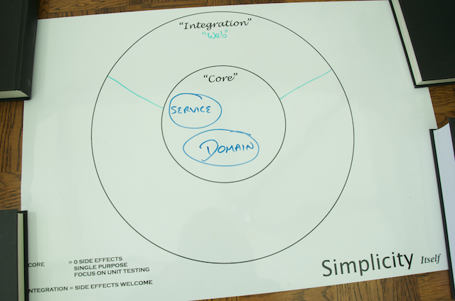

In this tutorial you'll learn to use Spring to create production-strength web applications.

## Spring and the Web

The web has become a core part of our lives, from shopping to finding the closest ATM. Web applications, server software sending HTML over HTTP, implement the web.

Spring helps you build web applications that scale from a small internal application to those serving millions of users and thousands of concurrent requests.

Whether you are beginning the construction of a web application using Spring, or are just curious on what a Spring backed web application looks like, you've come to the right place.

## What you'll build

Yummy Noodle Bar is going global. It wants to build an interactive web application to provide customers with the latest Yummky Noodle Menu and allow them to place orders and monitor the status of their order as it is being prepared.

You will extend Yummy Noodle Bar's existing application by adding an web components that will allow viewing the menu, creating and viewing the status of orders.


## What you'll need

* About thirty minutes for each section. You should be able to comfortably work your way through the entire tutorial during your lunch break in a week (or do it all on the weekend!)
* A copy of the code (available either by [git][u-git] or a [downloadable zip file](https://github.com/spring-guides/tut-web/archive/master.zip)).
* An IDE of your choice. Spring recommends [Spring Tool Suite](http://spring.io/tools/sts/all), which is a free download.


### Downloading and running the code

If you download the code base, you'll discover each section of this tutorial in a separate folder, numbered 1, 2, 3, etc. There are also several code drops: an **initial** one at the root, and a separate **complete** code drop for each section.

The **initial** code set contains:
- a project layout
- the core domain & event classes this tutorial starts off creating (the 'Yummy Noodle Bar Application', above)
- some basic unit tests for some of those classes

The **complete** code set in each section includes the initial code base plus the code developed up to that point in the tutorial.

You can choose to start with the **initial** code set, copy-and-paste your way through the guide, and then run things at the end. Or you can start with the **complete** code set for a given section, open each file, and read the source side-by-side as you walk through the tutorial.

While there are many build systems, this tutorial is built using [Gradle][gs-gradle] and includes the Gradle Wrapper, so you don't have to install anything to run the code.

For example, if you want to check out the initial code set:

```sh
$ git clone https://github.com/spring-guides/tut-web.git
$ cd tut-web/initial
$ ./gradlew clean test
```

From there, you can inspect `build/reports/tests` and see all the test results.

If you want to switch to section 6, the last part, and run the web application and it's tests do this:

```sh
$ cd ../6/complete
$ ./gradlew tomcatRunWar
```

In a separate console:

```sh
$ ./gradlew test
```

Some of the sections don't require running the web application to execute the tests.

[u-git]: /understanding/Git
[gs-gradle]: /guides/gs/gradle

## Yummy Noodle Bar application architecture and the Core domain

The current architecture of the application is shown in the following "Life Preserver" diagram:


The Life Preserver diagram is a tool for building applications that following the principles of the [Hexagonal Architecture, sometimes referred to as 'Ports and Adapters' originally characterised by Alistair Cockburn](http://alistair.cockburn.us/Hexagonal+architecture). The Life Preserver diagram shows your application's core internal domains along with the surrounding 'integration' domains that map directly to the packages and components that you'll be working within and upon throughout this tutorial, so it's a great way to understand where things are.

Open the **initial** project and you'll see that the life preserver diagram maps to the different packages under src/main/java/com/yummynoodlebar

Under the core application's top-level packages, that is, com.yummynoodlebar.core, here's what the packages contain:

* **domain**. Components that cleanly capture the application's Core domain concepts. These classes are a manifestation of the [ubiquitous language](http://martinfowler.com/bliki/UbiquitousLanguage.html) of the Core domain.

* **service**. Components that handle the actions that can be performed when an event is received.

Take a moment to familiarize yourself with the components in each package. The tests for the core domain components are available in the src/test area in the `initial` project. They will give you an idea of how these components will be used.

## Web domain

A web front end integrates your application with web browsers and their users. As such, the web front end lives in its own integration domain on the periphery of your application's core, as show in the following update to your life preserver.



Given the integration between your application and the outside world, consider the following design and implementation constraints:

* The user experience (UX) is your focus; the core application structure should not influence the design of the web front end.
* The components that make up your Web domain need to evolve at a rate that is appropriate for the many consumers that rely on your services.
* Your Web components should not contain any core logic for your application, but they will collaborate with other components in the Core domains of your application in order to orchestrate the necessary functionality for the service interface.


## Tutorial Roadmap

* [Step 1: Modelling the Core and Web Domains](1/)
* [Step 2: Implementing URLs and returning data](2/)
* [Step 3: Configuring a basic application](3/)
* [Step 4: Creating rich HTML views using Thymeleaf](4/)
* [Step 5: Accepting user submitted data](5/)
* [Step 6: Securing the Web Application](6/)
* [Recap and What's Next?](8/)
